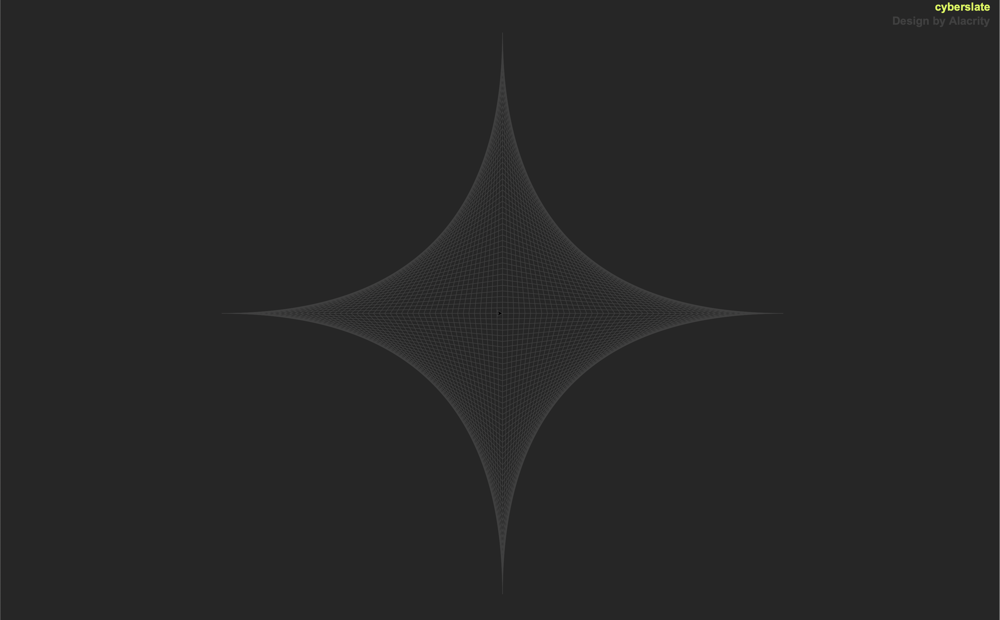

# Designs by Alacrity

*"All ends are beginnings." - The Exo Stranger, 2014*

---

## Origin

In math class in 8th grade, I created a cool design with my TI-83 Plus calculator using rectilinear functions. Twenty years later, I recreated the design in my first coding class. 

Since then, I have programmatically reproduced this pattern many times. I have used the images on my desktop backgrounds, social media, curriculum vitae, and terminal profiles. Below is the design produced from the original pattern, which in my mind I call "[8th Grade Math](Images/cyberslate.png)" (for lack of a better name).

## Variant

Below is a variant of the original pattern (both of which create a curvilinear appearance / dimensionality with rectilinear lines).